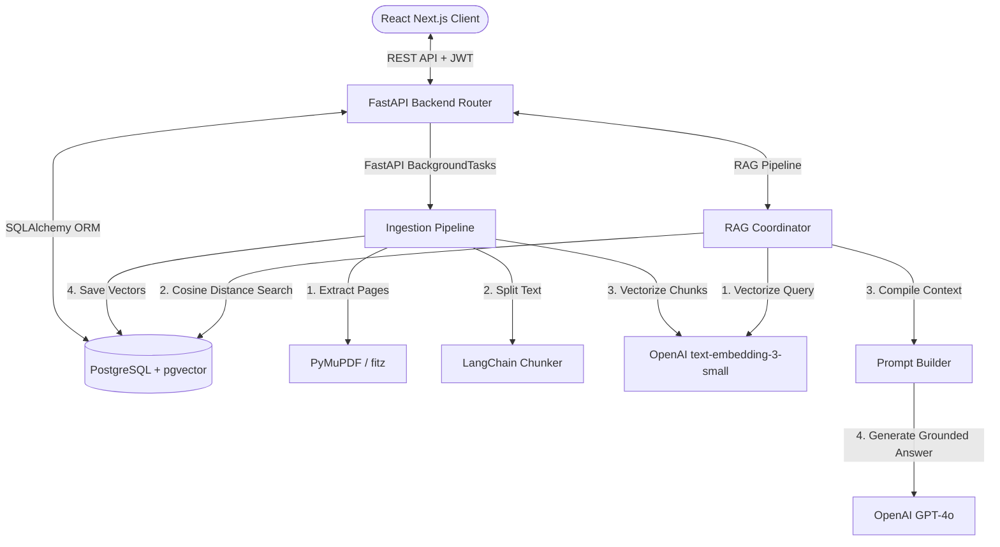
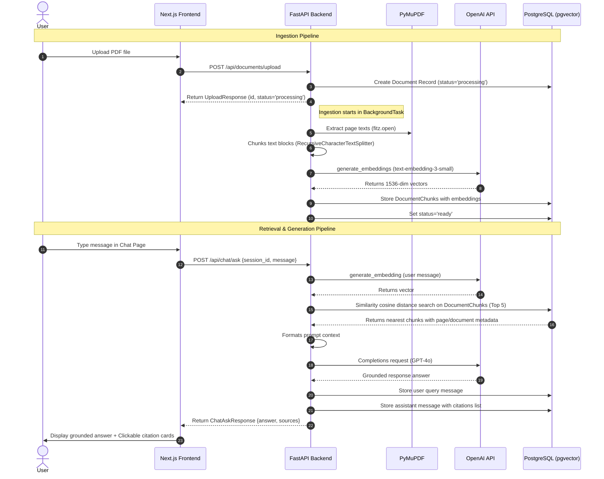
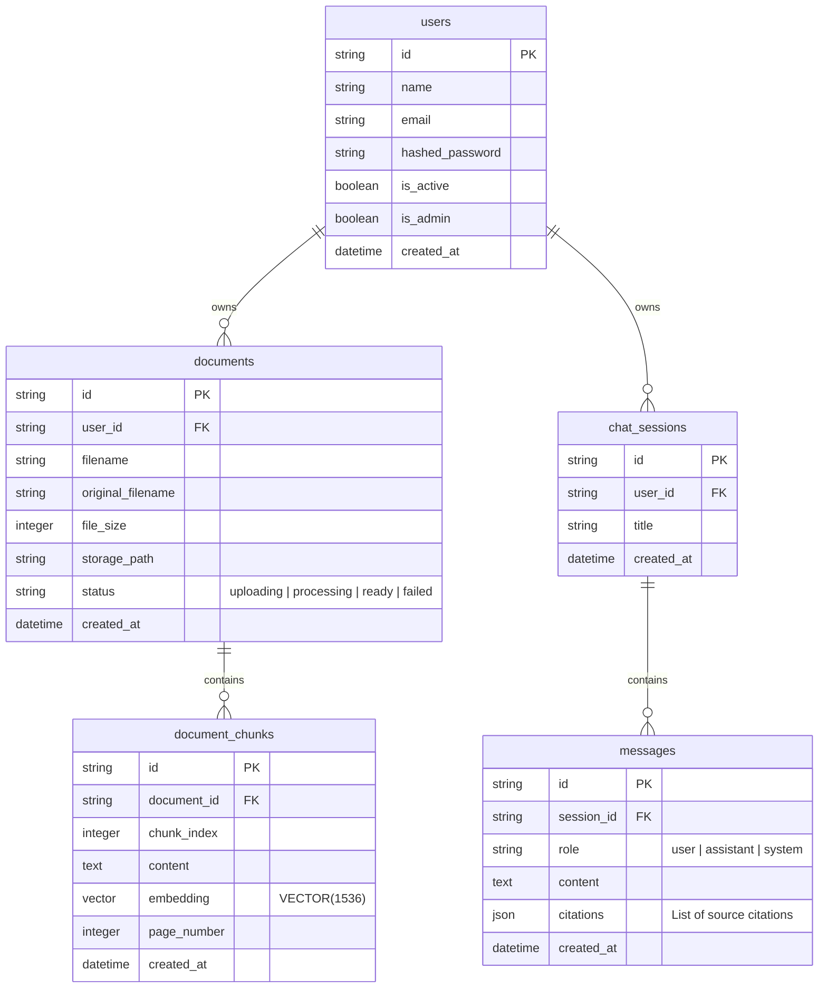

# DocuMind AI — RAG Engine Architecture (Version 3)

This document details the Retrieval-Augmented Generation (RAG) processing engine introduced in DocuMind AI Version 3, covering architecture diagrams, database schemas, and pipeline workflows.

---

## 1. System Architecture Diagram

The system coordinates the Next.js frontend, FastAPI backend, PostgreSQL database with the `pgvector` extension, and OpenAI API endpoints:



---

## 2. Data Flow Diagram

The step-by-step workflow for document processing and chat querying:



---

## 3. Database Schema

The RAG platform extends the PostgreSQL schema with vector support:



---

## 4. Pipeline Details

### Ingestion Workflow (PDF Processing Module)
* **Extraction (`pdf_loader.py`):** Uses PyMuPDF (`fitz`) to extract page-by-page text. Text is associated with its source page number (1-indexed) to preserve page numbers.
* **Chunking (`chunker.py`):** Utilizes LangChain's `RecursiveCharacterTextSplitter` configured with a chunk size of `1000` characters and an overlap of `200` characters. This ensures text segments are reasonably sized and contextual boundaries are maintained.
* **Vector Embeddings (`embedding_service.py`):** The OpenAI embedding model `text-embedding-3-small` creates 1536-dimensional vector representations of each text chunk.
* **Storage (`ingestion_service.py`):** Stores chunks directly in the `document_chunks` table, database writes are executed, and document status is updated to `ready`.

### Retrieval Workflow (`retriever.py`)
Similarity search is executed directly inside PostgreSQL using the pgvector operator `<=>` (cosine distance). The query returns the top 5 chunks closest to the user's question embedding:
```sql
SELECT dc.content, dc.page_number, d.original_filename
FROM document_chunks dc
JOIN documents d ON dc.document_id = d.id
WHERE d.user_id = :user_id
ORDER BY dc.embedding <=> :query_embedding
LIMIT 5;
```

### Generation Workflow (`llm_service.py` & `rag_pipeline.py`)
GPT-4o synthesizes the final response. It is strictly constrained by system prompts to ONLY answer questions using the formatted context. If the query cannot be resolved from the context, the system responds with:
> *"I couldn't find this information in the uploaded documents."*
